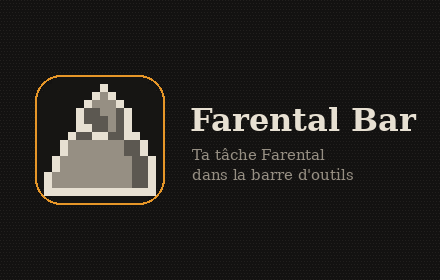
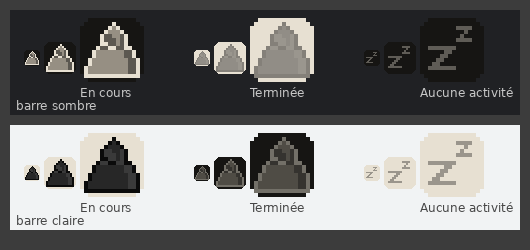

  <b>Français</b> · <a href="#english">English</a> · <a href="#deutsch">Deutsch</a>

# Farental Bar

Ta tâche **Farental** en cours, directement dans la barre d'outils de Firefox ou de Chrome.

- **Pendant la tâche** : l'icône montre son type (voyage, combat, activité, artisanat) et change de couleur de gauche à droite au fil de l'avancement.
- **Tâche terminée** : l'icône pulse avec un fin trait ambré. Un clic affiche la page du jeu (en réutilisant l'onglet Farental déjà ouvert) pour réclamer ta récompense.
- **Un clic pendant la tâche** ouvre une petite fenêtre : titre complet, décompte à la seconde, heure de fin.
- **« Zz »** quand ton personnage ne fait rien.
- S'adapte aux thèmes clair et sombre ; en français, anglais et allemand.

> Extension **non officielle**, créée par un joueur. Version alpha : merci de signaler ce qui cloche !

## Installer

### Firefox

1. Télécharge **[farental-bar.xpi](https://github.com/anjclerc/farental-bar/releases/latest/download/farental-bar.xpi)** (dernière version, signée par Mozilla).
2. Firefox propose de l'installer : accepte. Si le fichier a seulement été téléchargé, glisse-le dans une fenêtre Firefox, ou `about:addons` → ⚙ → *Installer un module depuis un fichier*.
3. Si l'icône n'apparaît pas dans la barre, clique sur le bouton des extensions (pièce de puzzle) et épingle **Farental Bar**.

### Chrome, Edge, Brave…

La fiche du Chrome Web Store est en cours de validation : le lien sera ajouté ici dès qu'elle sera publiée.

### Configurer (une seule fois)

1. Sur [farental.ch/account](https://farental.ch/account), section **Widget de stream**, génère ton lien de stream.
2. Clique sur l'icône **?** de l'extension, colle le lien dans les réglages, puis **Enregistrer et tester**.

Le lien ne donne accès qu'à ta tâche en cours, en lecture. **Ne le partage pas** : chacun utilise le sien. S'il a fuité, régénère-le sur farental.ch/account.

### Mettre à jour

Pour l'instant, installe simplement la nouvelle version par-dessus l'ancienne (même lien que ci-dessus) : tes réglages sont conservés. Toutes les versions sont sur la page [Releases](https://github.com/anjclerc/farental-bar/releases).

## Confidentialité

L'extension ne contacte que farental.ch, n'envoie aucune donnée ailleurs et ne collecte rien. Détails : [PRIVACY.md](PRIVACY.md).

## Un problème, une idée ?

Ouvre une [issue](https://github.com/anjclerc/farental-bar/issues) ou écris sur le fil du forum. Le plus utile : **le titre exact d'une tâche** qui affiche un sablier au lieu de la bonne icône.

---

## English

Your current **Farental** task, right in the Firefox or Chrome toolbar: the icon shows the kind of task and fills up from left to right as it progresses, pulses with a thin amber line when the task is done (one click opens the game page to claim your reward), and shows "Zz" when your character is idle. Clicking during a task opens a small window with a second-by-second countdown. Unofficial extension made by a player.

**Install (Firefox)**: download **[farental-bar.xpi](https://github.com/anjclerc/farental-bar/releases/latest/download/farental-bar.xpi)** (signed by Mozilla) and accept the installation, or drag the file into a Firefox window. Chrome: the Web Store listing is under review.

**Set up**: on [farental.ch/account](https://farental.ch/account), *Stream widget* section, generate your stream link, then click the extension's **?** icon and paste it in the settings. The link only gives read access to your current task; don't share it.

**Privacy**: the extension only talks to farental.ch and collects nothing ([PRIVACY.md](PRIVACY.md)). Problems or ideas: [issues](https://github.com/anjclerc/farental-bar/issues).

## Deutsch

Deine laufende **Farental**-Aufgabe direkt in der Symbolleiste von Firefox oder Chrome: Das Symbol zeigt die Art der Aufgabe und füllt sich mit dem Fortschritt von links nach rechts, pulsiert mit einer feinen bernsteinfarbenen Linie, wenn die Aufgabe fertig ist (ein Klick öffnet die Spielseite zum Abholen der Belohnung), und zeigt „Zz“, wenn dein Charakter nichts tut. Ein Klick während der Aufgabe öffnet ein kleines Fenster mit sekundengenauem Countdown. Inoffizielle Erweiterung, von einem Spieler erstellt.

**Installieren (Firefox)**: **[farental-bar.xpi](https://github.com/anjclerc/farental-bar/releases/latest/download/farental-bar.xpi)** herunterladen (von Mozilla signiert) und die Installation bestätigen, oder die Datei in ein Firefox-Fenster ziehen. Chrome: Der Eintrag im Web Store wird gerade geprüft.

**Einrichten**: Auf [farental.ch/account](https://farental.ch/account) im Bereich *Stream-Widget* den Stream-Link erzeugen, dann auf das **?**-Symbol der Erweiterung klicken und den Link in den Einstellungen einfügen. Der Link erlaubt nur Lesezugriff auf deine laufende Aufgabe; gib ihn nicht weiter.

**Datenschutz**: Die Erweiterung kommuniziert nur mit farental.ch und sammelt nichts ([PRIVACY.md](PRIVACY.md)). Probleme oder Ideen: [Issues](https://github.com/anjclerc/farental-bar/issues).
